# ☁️ AWS Academy – Criando uma VPC e Executando um Servidor Web

---

## 🧠 Objetivos do Laboratório

- Criar uma **Amazon VPC personalizada**.  
- Configurar **sub-redes públicas e privadas** em múltiplas zonas de disponibilidade.  
- Criar e associar **tabelas de rotas**, **Internet Gateway** e **NAT Gateway**.  
- Criar um **grupo de segurança (Security Group)** permitindo tráfego HTTP.  
- Executar uma **instância EC2** configurada automaticamente para atuar como **servidor web Apache**.  

---

## 🌐 Criação da VPC e Sub-redes

Foi criada a VPC `lab-vpc` com **IPv4 CIDR Block: 10.0.0.0/16** e as seguintes sub-redes:

- **Sub-rede pública:** `10.0.0.0/24` → 256 endereços  
- **Sub-rede privada:** `10.0.1.0/24` → 256 endereços

Essa configuração permite **isolamento entre recursos públicos e privados** e prepara a VPC para futuras expansões.

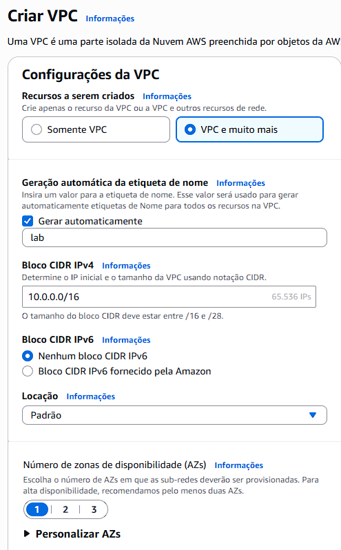
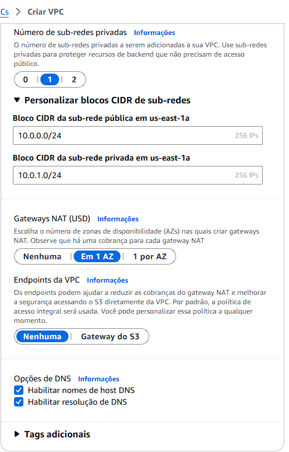

---
## 🗺️ Mapa de Recursos
Diagrama resumido mostrando a **VPC, sub-redes públicas e privadas, Internet Gateway e instância EC2** do laboratório.

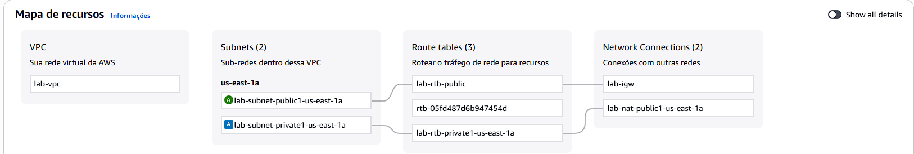

---
## 🌐 Criação da VPC e Sub-redes

Foi criada a VPC `lab-vpc` com **IPv4 CIDR Block: 10.0.0.0/16** e as seguintes sub-redes:

- **Sub-rede pública:** `10.0.2.0/24` → 256 endereços 
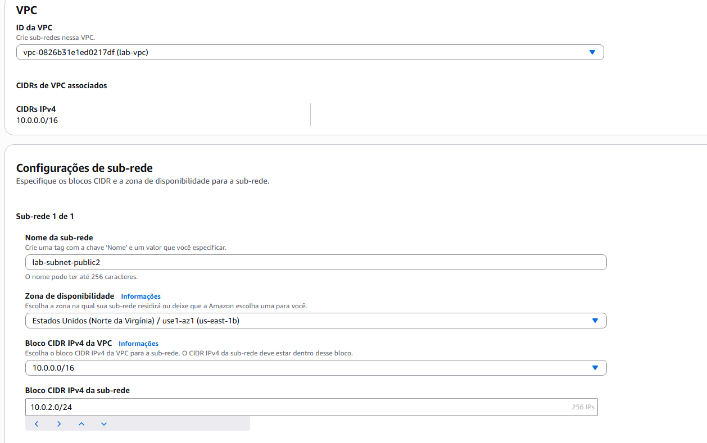

- **Sub-rede privada:** `10.0.3.0/24` → 256 endereços
- 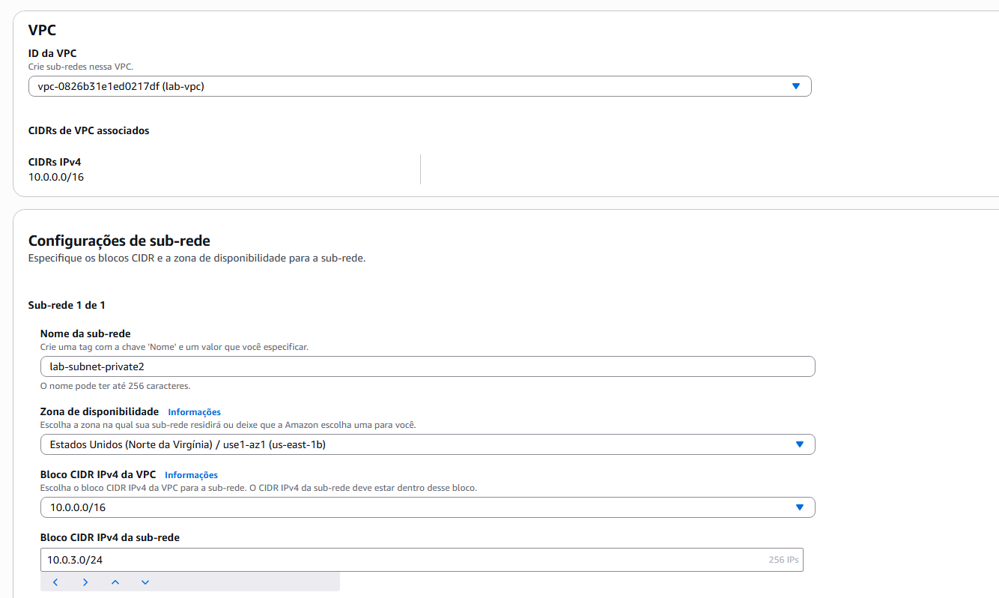

Essa configuração permite **isolamento entre recursos públicos e privados** e prepara a VPC para futuras expansões.

---
## 🔁 Associação de Sub-redes

As tabelas de rotas foram configuradas para garantir que as sub-redes corretas tenham acesso à internet conforme sua função:

- **Sub-redes associadas:**  
- `lab-subnet-private1-us-east-1a`  
- `lab-subnet-private2`

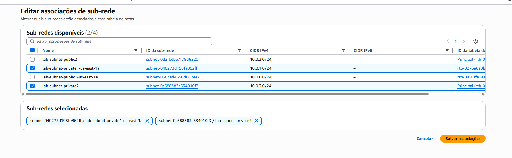

- **Tabela de rota privada:** `lab-rtb-private1-us-east-1a`

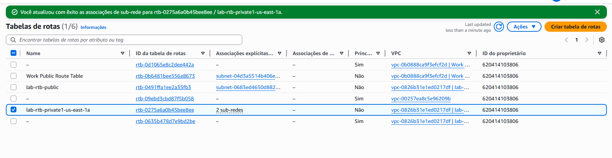

- **Sub-redes associadas:**
- `lab-subnet-public2`
- `lab-subnet-public1-us-east-1a`

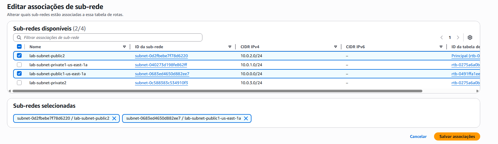

- **Tabela de rota privada:** `lab-rtb-public`

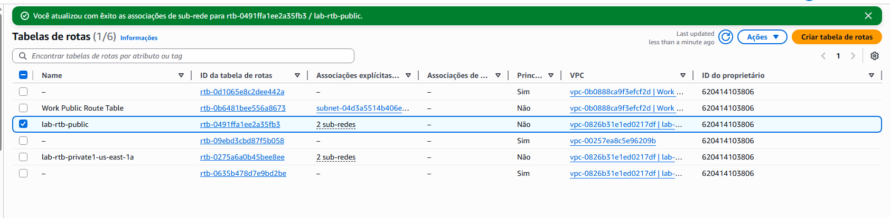

---

## 🔒 Criação do Grupo de Segurança – Web Security Group

Foi criado um **grupo de segurança** para controlar o tráfego de rede da instância web. Ele atua como um firewall virtual dentro da VPC, permitindo apenas o tráfego necessário para o servidor.
| Parâmetro | Valor |
|------------|--------|
| **Nome** | `Web Security Group` |
| **Descrição** | Enable HTTP access |
| **VPC Associada** | `lab-vpc` |
| **Tipo de Regra** | Entrada (Inbound) |
| **Protocolo** | HTTP |
| **Porta** | 80 |
| **Origem** | Anywhere (0.0.0.0/0) |
| **Descrição da Regra** | Permit web requests |

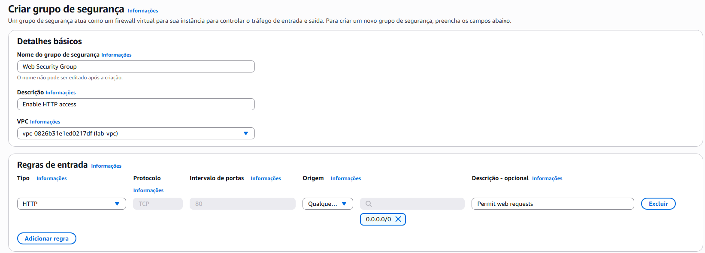

---
## 💻 Criação da Instância EC2 – Servidor Web

Foi criada uma **instância EC2** para hospedar o servidor web Apache dentro da sub-rede pública da VPC.

| Parâmetro | Valor |
|------------|--------|
| **Nome da Instância** | `Web Server 1` |
| **Sistema Operacional** | Amazon Linux 2 |
| **Tipo de Instância** | `t2.micro` |
| **Sub-rede** | `lab-subnet-public1-us-east-1a` |
| **IP Público** | Atribuído automaticamente |

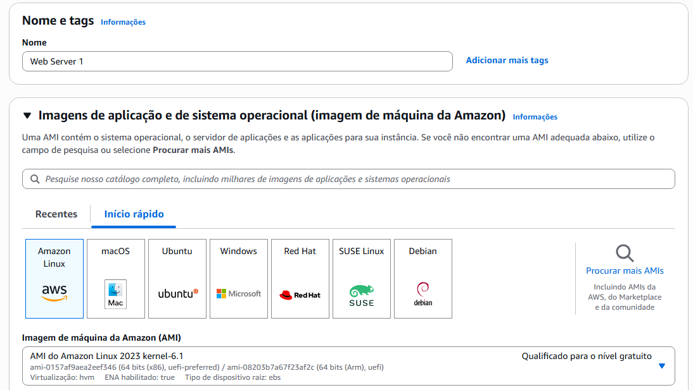

